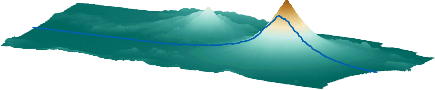

<!--- Copyright 2013-2019 CS Systèmes d'Information
  Licensed under the Apache License, Version 2.0 (the "License");
  you may not use this file except in compliance with the License.
  You may obtain a copy of the License at
  
    http://www.apache.org/licenses/LICENSE-2.0
  
  Unless required by applicable law or agreed to in writing, software
  distributed under the License is distributed on an "AS IS" BASIS,
  WITHOUT WARRANTIES OR CONDITIONS OF ANY KIND, either express or implied.
  See the License for the specific language governing permissions and
  limitations under the License.
-->

<h1 style="color:blue;" align="center">
  Rugged
</h1>
<h1>
  
  A sensor-to-terrain mapping tool
</h1>

<h4 align="center">Rugged is a free java library for geolocation and used for satellite imagery.</h4>

  <a href="#introduction">Introduction</a> •
  <a href="#design">Design</a> •
  <a href="#tutorial">Tutorial</a> •
  <a href="#development">Development</a>

Rugged is an add-on for [Orekit](https://www.orekit.org/ "Orekit homepage") handling Digital Elevation Models contribution to 
line of sight computation. It is a free software intermediate-level library written in Java.

It mainly provides direct and inverse location, i.e. it allows to compute accurately 
which ground point is looked at from a specific pixel in a spacecraft instrument, 
and conversely which pixel will see a specified ground point. This mapping between 
ground and sensor is computed with a viewing model taking into account:
* ground Digital Elevation Model (DEM), 
* Earth rotation will all its tiny irregularities, 
* on-board sensor pixels individual line-of-sights, 
* spacecraft motion and attitude,
* several physical effects.

Direct and inverse location can be used to perform full ortho-rectification of 
images and correlation between sensors observing the same area.

Homepage: [www.orekit.org/rugged/](https://www.orekit.org/rugged/ "Rugged homepage")
